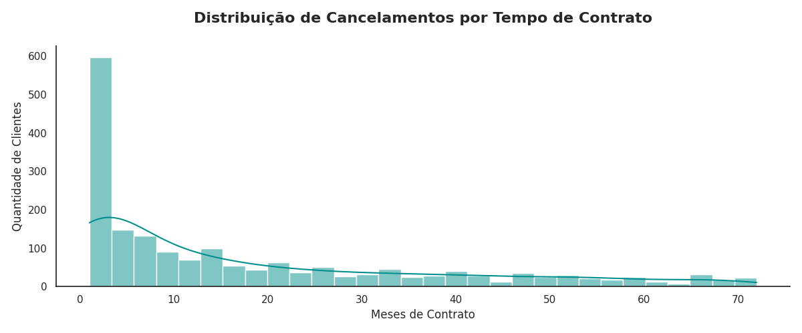
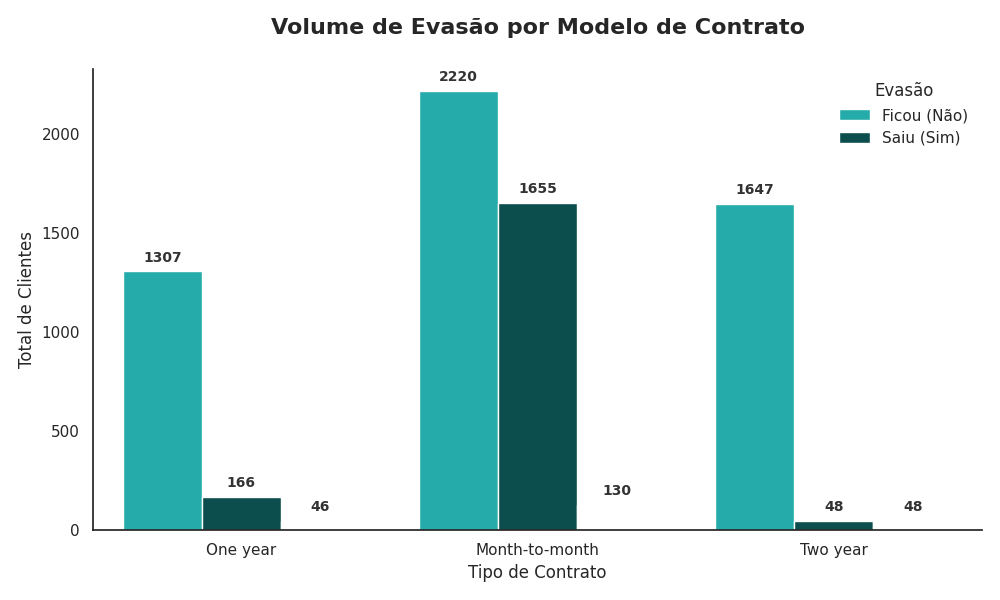
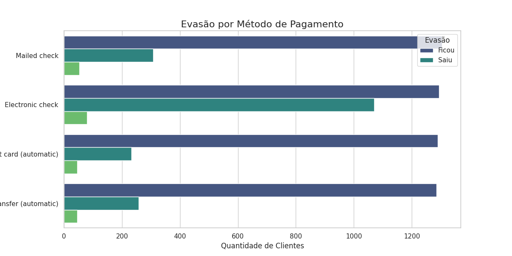

# 📊 Projeto Telecom X: Inteligência de Dados e Análise de Churn

Este projeto consiste em um pipeline completo de análise de dados voltado para a retenção de clientes (**Churn Rate**) na empresa Telecom X. O trabalho abrange desde o processo de **ETL** (Extração, Transformação e Carga) até a geração de **insights estratégicos** para tomada de decisão de negócio.

## 🚀 Visão Geral do Projeto
O objetivo principal foi identificar por que os clientes estão deixando a empresa e qual o impacto financeiro dessa perda. A base de dados original foi processada para revelar padrões comportamentais que servirão de base para o treinamento de modelos de **Machine Learning**.

## 🛠️ Tecnologias Utilizadas
* **Linguagem:** Python 3.x
* **Manipulação de Dados:** Pandas e NumPy
* **Visualização:** Matplotlib e Seaborn
* **Ambiente:** Google Colab

## 🔧 Pipeline de Dados (ETL)

1.  **Extração:** Carregamento de dados brutos via API/URL no formato JSON.
2.  **Transformação:**
    * Tratamento de valores ausentes e conversão de tipos de dados (`float64`).
    * Tradução de rótulos de colunas e categorias para o português.
    * **Feature Engineering:** Criação da variável `Qtd_Servicos` (densidade de produtos).

## 📊 Principais Insights e Visualizações

### 1. Perfil Temporal da Evasão
A análise de distribuição revelou que o **Mês 1** é o ponto de ruptura mais crítico para a operação. Clientes que superam os primeiros 10 meses apresentam maior taxa de fidelidade.

### 2. Impacto do Modelo Contratual
Os contratos **mês a mês** representam a grande maioria das perdas. Como demonstrado abaixo, o volume de saídas é drasticamente menor em contratos de longo prazo.

### 3. Fatores de Risco por Pagamento
Clientes que utilizam **Cheque Eletrônico** apresentam uma taxa de evasão significativamente maior do que métodos automáticos (Cartão ou Débito).

## 📄 Relatório de Impacto Financeiro

| Métrica | Valor |
| :--- | :--- |
| **Base Total de Clientes** | 7.267 |
| **Taxa de Churn** | 25,72% |
| **Prejuízo Acumulado** | R$ 2.862.926,90 |
| **Média de Serviços** | 4,14 por cliente |

## 🏁 Conclusões e Recomendações
* **Ação Imediata:** Implementar suporte proativo e bônus nos primeiros 90 dias de contrato.
* **Migração de Planos:** Criar campanhas de incentivo para conversão de planos mensais em anuais.
* **Fidelização Técnica:** Melhorar a estabilidade dos serviços de Internet/Fibra, identificados como pontos de atrito.

---
**Autor:** Vitor Hugo
